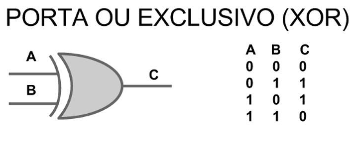
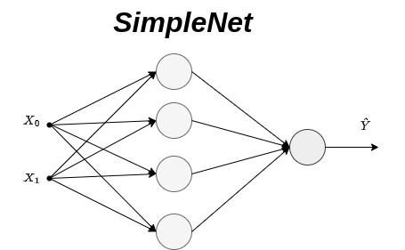

# Anatomia de Uma Rede Neural | SimpleNet

## 1. Introdução 📖

Neste projeto, embarcamos em uma exploração detalhada para desvendar os intricados detalhes da construção de modelos de Deep Learning. O objetivo principal é fornecer um entendimento abrangente das etapas fundamentais envolvidas na construção desses modelos, utilizando as poderosas ferramentas PyTorch e PyTorch Lightning.

O <a href="https://pytorch.org/get-started/pytorch-2.0/" target="_blank">PyTorch</a> é uma biblioteca de aprendizado profundo de código aberto que oferece a flexibilidade e a velocidade necessárias na pesquisa de aprendizado profundo. Ele suporta operações de tensor com aceleração de GPU, fornece uma plataforma de aprendizado profundo que oferece versatilidade e velocidade, e se integra perfeitamente ao ecossistema Python.

Por outro lado, o <a href="https://lightning.ai/docs/pytorch/stable/" target="_blank">PyTorch Lightning</a> é uma estrutura leve que organiza o código PyTorch. Ele permite que os pesquisadores se concentrem nas partes inovadoras de seus projetos, eliminando a necessidade de escrever código repetitivo. Construído sobre o PyTorch, o PyTorch Lightning permite que você escale seus modelos sem a necessidade de reescrever seu código.

Este caderno vai além de um simples tutorial; é uma exploração prática do mundo fascinante do Deep Learning. Este projeto é fruto da minha formação como Engenheiro de Inteligência Artificial na <a href="https://www.datascienceacademy.com.br/start" target="_blank">Data Science Academy</a>. Com este caderno, esperamos não apenas ensinar, mas também inspirar você a explorar ainda mais as possibilidades do Deep Learning.

## 2. Configuração ⚙️

### 2.1 Carga de Pacotes Python

O caderno criado para este projeto utiliza várias bibliotecas Python, cada uma com um propósito específico, algumas das principais são:

1. **os**: `Interage com o sistema operacional, permitindo a manipulação de arquivos e diretórios.`
2. **warnings**: `Emite mensagens de aviso ao usuário.`
4. **torch e lightning (pl)**: `PyTorch é usado para aprendizado profundo e PyTorch Lightning organiza o código PyTorch.`

     
    

## 3. Preparação e Carregamento dos Dados 💽

### 3.1 Gerando Dados para o Problema XOR (OU Exclusivo)

Este projeto prepara um conjunto de dados para treinar um modelo de rede neural para resolver o problema XOR. O problema XOR é um problema clássico em redes neurais que não pode ser resolvido por uma única camada de perceptron, pois os dados do XOR não são linearmente separáveis.

A criação dos dados para treinamento consiste em:

1. **Dados de entrada e saída**: As variáveis `dados_entrada` e `dados_saida` contêm os quatro possíveis pares de entradas binárias e suas respectivas saídas para a operação XOR. Por exemplo, [0, 0] produz 0 e [0, 1] produz 1.

2. **Dataset final**: A variável `dados_final` combina os dados de entrada e saída em uma única lista de tuplas. Cada tupla contém um par de entrada e a saída correspondente.

3. **DataLoader**: A variável `loader_treinamento` é um DataLoader do PyTorch, que é uma ferramenta para carregar os dados em lotes durante o treinamento de uma rede neural. Neste caso, o tamanho do lote é definido como 1, o que significa que cada lote conterá apenas um par de entrada-saída.
    

## 4. SimpleNet: Uma Visão Geral 🧠

A `SimpleNet` é uma classe que implementa uma rede neural simples usando PyTorch Lightning. A rede consiste em uma camada de entrada, uma camada de saída e uma função de ativação sigmóide.

No método `__init__`, a camada de entrada, a camada de saída, a função de ativação sigmóide e a função de perda são inicializadas. A camada de entrada é uma camada linear que recebe 2 entradas e produz 4 saídas. A camada de saída é outra camada linear que recebe 4 entradas (do output da camada de entrada) e produz 1 saída. A função de ativação sigmóide é usada para adicionar não-linearidade ao modelo. A função de perda usada é a perda quadrática média (MSE).

O método `forward` realiza a passagem para frente na rede neural. A entrada passa pela camada de entrada, depois pela função de ativação sigmóide e finalmente pela camada de saída.

O método `configure_optimizers` configura o otimizador para a rede neural. Ele usa o otimizador Adam com uma taxa de aprendizado de 0.01.

O método `training_step` realiza uma etapa de treinamento na rede neural. A perda é calculada comparando as saídas da rede com as saídas reais usando a função de perda definida no construtor.

---

### 4.1 Função de Custo (MSE)

A função de custo **Mean Squared Error** (MSE), ou Erro Quadrático Médio em português, é uma das funções de perda mais utilizadas para problemas de regressão. Ela calcula a média dos quadrados das diferenças entre os valores previstos e os valores reais.

Aqui está a fórmula matemática para o MSE:

$$MSE = \frac{1}{n} \sum_{i=1}^{n} (y_i - \hat{y}_i)^2$$

Onde:

- $n$ é o número total de exemplos no conjunto de dados
- $y_i$ é o valor real do i-ésimo exemplo
- $\hat{y}_i$ é o valor previsto do i-ésimo exemplo

O objetivo durante o treinamento de um modelo de aprendizado de máquina é minimizar essa função de perda. Isso significa que queremos que nossas previsões ($\hat{y}_i$) estejam o mais próximo possível dos valores reais ($y_i$). Quanto menor o MSE, melhor nosso modelo é capaz de realizar previsões precisas.

### 4.2 Algoritmo Adam (Adaptive Moment Estimation)

O algoritmo Adam (Adaptive Moment Estimation) é um método de otimização que pode ser usado em vez dos procedimentos clássicos de descida de gradiente estocástico para atualizar os pesos da rede de forma iterativa com base nos dados de treinamento.

Adam é uma combinação dos métodos AdaGrad e RMSProp, que são outros algoritmos de otimização. Ele calcula taxas de aprendizado adaptativas para diferentes parâmetros. Em outras palavras, ele computa médias móveis tanto do gradiente quanto do quadrado do gradiente, e essas médias são usadas para dimensionar a taxa de aprendizado.

Aqui estão as fórmulas matemáticas para o Adam:

$$m_t = \beta_1 \cdot m_{t-1} + (1 - \beta_1) \cdot g_t$$
$$v_t = \beta_2 \cdot v_{t-1} + (1 - \beta_2) \cdot g_t^2$$
$$\hat{m}_t = \frac{m_t}{1 - \beta_1^t}$$
$$\hat{v}_t = \frac{v_t}{1 - \beta_2^t}$$
$$\theta_t = \theta_{t-1} - \alpha \cdot \frac{\hat{m}_t}{\sqrt{\hat{v}_t} + \epsilon}$$

Onde:

- $m_t$ e $v_t$ são estimativas do primeiro momento (a média) e do segundo momento (a variância não centralizada) do gradiente, respectivamente.
- $\beta_1$ e $\beta_2$ são os fatores de decaimento para essas estimativas.
- $g_t$ é o gradiente no tempo $t$.
- $\hat{m}_t$ e $\hat{v}_t$ são versões corrigidas por viés de $m_t$ e $v_t$.
- $\alpha$ é a taxa de aprendizado.
- $\epsilon$ é um termo de suavização para evitar a divisão por zero.
- $\theta_t$ é o parâmetro atualizado no tempo $t$.

O algoritmo Adam é bastante eficaz e requer pouca configuração de memória, sendo uma escolha popular para redes neurais profundas.

### 4.3 Retropropagação no SimpleNet

O processo de retropropagação (Backward Propagation) é um algoritmo usado em redes neurais para calcular o gradiente da função de perda em relação aos pesos da rede. Ele é chamado de "backpropagation" porque o cálculo do gradiente é feito de trás para frente, começando da função de perda e indo até as camadas de entrada.

Aqui está uma descrição detalhada do processo de retropropagação na sua rede SimpleNet:

1. **Cálculo do Erro**: Primeiro, calculamos o erro da previsão usando a função de custo MSE. Para um único exemplo, o erro é dado por:

    $$E = \frac{1}{2}(y - \hat{y})^2$$

    onde $y$ é o valor real e $\hat{y}$ é o valor previsto pela rede.

2. **Gradiente na Camada de Saída**: O próximo passo é calcular o gradiente do erro em relação aos pesos da camada de saída. Usando a regra da cadeia, temos:

    $$\frac{\partial E}{\partial w_{out}} = \frac{\partial E}{\partial \hat{y}} \cdot \frac{\partial \hat{y}}{\partial w_{out}}$$

    Onde $w_{out}$ são os pesos da camada de saída. Calculamos cada parte separadamente:

    $$\frac{\partial E}{\partial \hat{y}} = -(y - \hat{y})$$

    $$\frac{\partial \hat{y}}{\partial w_{out}} = \hat{y}(1 - \hat{y}) \cdot h_{out}$$

    Onde $h_{out}$ é a saída da camada oculta. Portanto, o gradiente na camada de saída é:

    $$\frac{\partial E}{\partial w_{out}} = -(y - \hat{y}) \cdot \hat{y}(1 - \hat{y}) \cdot h_{out}$$

3. **Gradiente na Camada de Entrada**: Da mesma forma, podemos calcular o gradiente do erro em relação aos pesos da camada de entrada:

    $$\frac{\partial E}{\partial w_{in}} = \frac{\partial E}{\partial h_{out}} \cdot \frac{\partial h_{out}}{\partial w_{in}}$$

    Onde $w_{in}$ são os pesos da camada de entrada. Novamente, calculamos cada parte separadamente:

    $$\frac{\partial E}{\partial h_{out}} = \frac{\partial E}{\partial \hat{y}} \cdot \frac{\partial \hat{y}}{\partial h_{out}} = -(y - \hat{y}) \cdot \hat{y}(1 - \hat{y})$$

    $$\frac{\partial h_{out}}{\partial w_{in}} = h_{out}(1 - h_{out}) \cdot x$$

    Onde $x$ é a entrada para a rede. Portanto, o gradiente na camada de entrada é:

    $$\frac{\partial E}{\partial w_{in}} = -(y - \hat{y}) \cdot \hat{y}(1 - \hat{y}) \cdot h_{out}(1 - h_{out}) \cdot x$$

4. **Atualização dos Pesos**: Finalmente, usamos o algoritmo Adam para atualizar os pesos em ambas as camadas. O Adam ajusta a taxa de aprendizado para cada peso individualmente, com base nas estimativas do primeiro e segundo momentos do gradiente.

## 5. Avaliação e Conclusão 🎯

Os resultados obtidos demonstram que a rede neural `SimpleNet` foi capaz de aprender com sucesso a função XOR. As previsões do modelo para as quatro combinações possíveis de entradas binárias correspondem exatamente aos valores reais. Isso indica que a rede foi capaz de capturar a relação não linear entre as entradas e a saída, demonstrando a eficácia do uso de redes neurais multicamadas e do algoritmo de otimização Adam para resolver problemas complexos de classificação binária. Esses resultados promissores sugerem que abordagens semelhantes podem ser aplicadas com sucesso a problemas mais complexos e desafiadores em aprendizado de máquina e inteligência artificial.